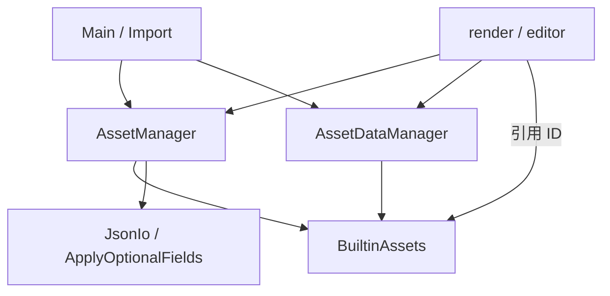

# Asset 模块依赖

## 模块说明

### AssetID

`AssetID<T>` 以字符串保存名字和文件名，同时用资产类型 `T` 区分引用。同一资产类型内 ID 唯一。配置、场景和所有资产描述统一以 `{"value": "..."}` 保存 ID。

### Asset

`TextureAsset`、`MeshAsset`、`MaterialAsset`、`ShaderAsset`、`SceneAsset`、`EnvironmentMapAsset`、`SamplerAsset` 直接继承空基类 `Asset`，并直接声明持久化字段。
`AssetTypes` 在定义末尾列出全部资产。`AssetType` 检查类型化 ID、`id` 字段和显式目录名 `dir`；JSON 存于 `assets/<dir>/`，例如 `assets/Texture/`，不依赖 C++ 类型名。
`MaterialOverride` 是 `MaterialAsset` 的别名，表示物体局部覆写；有值的 optional 字段参与合并，ID 不参与覆写。
`SamplerAsset` 保存 Vulkan sampler 的过滤、寻址、LOD、各向异性、比较和边框颜色参数。
`maxLod` 留空表示不限制最大 LOD，创建 Vulkan 对象时映射为 `VK_LOD_CLAMP_NONE`；显式 `0.0` 仅使用基础 mip。
`TextureBinding` 将纹理 ID 与 sampler ID 一起用于材质和环境贴图。

### AssetManager

底层资产读写和缓存工具。启动时扫描资产 JSON 并直接缓存资产对象；`get(id)` 返回只读引用，`find(id)` 返回指针，`save(asset)` 持久化并更新缓存。
查询内置 ID 时从 `BuiltinAssets` 获取资产。它不创建 GPU 对象，也不负责场景实例化或生命周期。

### AssetDataManager

二进制数据层。按 `MeshAsset` / `TextureAsset` 读写几何与贴图像素：`Source::File` 走 `assets/binary/{geometry,texture}/`，
`Source::Builtin` 调 `BuiltinAssets` 的 data 接口。Import 写入、RenderResourceManager 读取，都不绕过它碰磁盘。

### BuiltinAssets

被动内置资产集合。通过 `BuiltinAssets::Mesh` / `Material` / `Texture` / `Sampler` 分组暴露类型化 ID，供场景、Import、灯光标记等引用。资产 / data 生成函数为
private，仅 `AssetManager` 与 `AssetDataManager` 以 friend 调用；无实例、无 `init` 预注册。实现拆在 `builtin/` 下按类型分文件。

### JsonIo / ApplyOptionalFields

序列化与字段工具，不算业务流程模块。`JsonIo` 统一调用 C++26 静态反射的 `Serialize/Deserialize`，字段名直接使用 C++ 成员名。
全部字段必须存在，空 optional 显式保存为 null；完整描述中的未知字段报错。保存仍通过临时文件替换目标文件。
`ApplyOptionalFields` 用相同的静态反射字段遍历，按 optional 有值才覆盖，给材质 override 合并用；非 optional 字段不参与覆盖。
两者都不持有资产状态。

### Main / Import 与 render / editor

Import（经 `AssetImporter`）解码源文件后，向 DataManager 写 binary、向 AssetManager `save` 资产。render / editor 只读两侧
Manager；需要默认白贴图、内置网格等时引用 Builtin 的 ID，不调用其生成接口。
