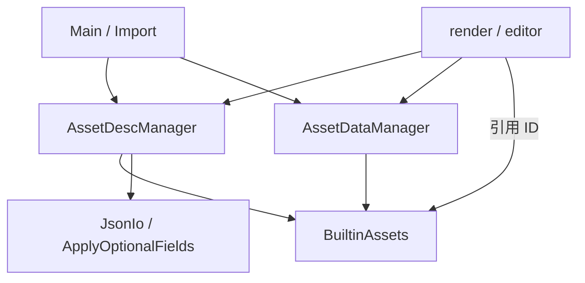

# Asset 模块依赖

## 模块说明

### AssetID

`AssetID<T>` 以字符串保存名字和文件名，同时用资产类型 `T` 区分引用。同一资产类型内 ID 唯一；JSON 中仍是普通字符串。
### Asset
资产类型直接声明，`Desc` 定义在对应类型中，`AssetTypes` 在定义末尾列出全部资产。描述文件存于 `assets/<资产类名>/`，例如 `assets/Texture/`。
`Sampler::Desc` 保存 Vulkan sampler 的过滤、寻址、LOD、各向异性、比较和边框颜色参数。
`maxLod` 留空表示不限制最大 LOD，创建 Vulkan 对象时映射为 `VK_LOD_CLAMP_NONE`；显式 `0.0` 仅使用基础 mip。
`TextureBinding` 将纹理 ID 与 sampler ID 一起用于材质和环境贴图。

### AssetDescManager

AssetDesc管理，提供查询和保存接口 。启动时扫描所有desc并在内存中缓存。检测到builtinID会从BuiltinAsset中获取Desc

### AssetDataManager

二进制数据层。按 `Mesh::Desc` / `Texture::Desc` 读写几何与贴图像素：`Source::File` 走 `assets/binary/{geometry,texture}/`，
`Source::Builtin` 调 `BuiltinAssets` 的 data 接口。Import 写入、RenderResourceManager 读取，都不绕过它碰磁盘。

### BuiltinAssets

被动内置资产集合。对外暴露 `Mesh` / `Material` / `Texture` / `Sampler` 的类型化 ID，供场景、Import、灯光标记等引用。desc / data 生成函数为
private，仅 `AssetDescManager` 与 `AssetDataManager` 以 friend 调用；无实例、无 `init` 预注册。实现拆在 `builtin/` 下按类型分文件。

### JsonIo / ApplyOptionalFields

序列化与字段工具，不算业务流程模块。`JsonIo` 给 DescManager 做 JSON 读写；`ApplyOptionalFields` 按 optional 有值才覆盖，给材质
override 合并用。两者都不持有资产状态。

### Main / Import 与 render / editor

Import（经 `AssetImporter`）解码源文件后，向 DataManager 写 binary、向 DescManager `save` 描述。render / editor 只读两侧
Manager；需要默认白贴图、内置网格等时引用 Builtin 的 ID，不调用其生成接口。
